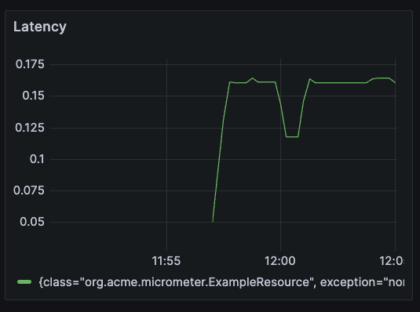

# Grafana & Quarkus Micrometer Demo

1. Start Quarkus sample app

        cd micrometer-quickstart

        mvn clean compile quarkus:dev

1. Start Grafana and Prometheus

        docker compose up -d

1. Login to Grafana at http://localhost:3000, username and password are both `admin`

1. In Grafana, go to Home > Connections > Data sources > Add data source. Then add `Prometheus` as data source, URL is `http://prometheus:9090`

1. Click on + sign at top right corner, then click on import dashboard

1. Enter the Dashboard ID or the JSON. E.g. [14370](https://grafana.com/grafana/dashboards/14370-jvm-quarkus-micrometer-metrics/)

  

## Test
Send a http req every 1 second and print the execution time

    while true; do time curl localhost:8080/example/random; sleep 1; echo; done

>:warning: You might need to change TIMEFMT on your machine to display time in smaller granularity
